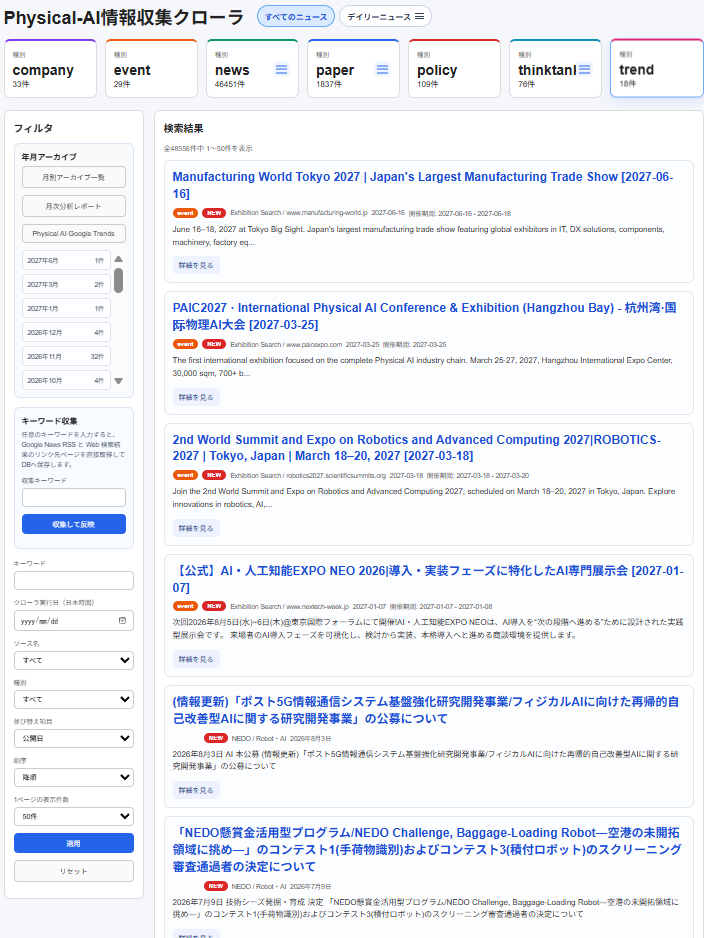

# TechInfo_Aggregator

Physical AI / Robotics 関連の情報を収集して、Flask で一覧表示するアプリです。

## Webアプリ画面と機能ガイド



上の画面はトップページ（`http://127.0.0.1:5000`）です。収集済みのニュース、論文、イベント、企業・政策・シンクタンク情報、Google Trends を、カテゴリ別に確認・検索できます。

### 画面上部：一覧とカテゴリの切り替え

| 操作箇所 | できること |
| --- | --- |
| **すべてのニュース** | 取得済みの全データを一覧表示します。 |
| **デイリーニュース** | 今日・昨日・任意の日付に取得した情報へ切り替えます。日付を指定した画面では、その日の情報をPDFとして開く・ダウンロードする操作もできます。 |
| **company / event / news / paper / policy / thinktank / trend のタイル** | タイルを選択すると、該当する種別だけに絞り込みます。数字は現在の件数です。 |
| タイル内の **≡ メニュー** | `news`、`paper`、`thinktank` などでは、より細かいカテゴリや情報元を選んで絞り込めます。たとえばニュースは Physical AI、Robot Makers、Real Haptics、Startup、Google News などで確認できます。 |

`event` タイルを選ぶと、通常の一覧ではなく月間カレンダーを表示します。開催国で絞り込め、イベント名から概要・開催期間・会場を確認できます。

### 左側：検索・絞り込み

| 操作箇所 | できること |
| --- | --- |
| **年別アーカイブ** | 月別アーカイブ一覧、月次分析レポート、Physical AI Google Trends を開きます。月名のボタンを選ぶと、その公開月の記事だけを表示します。 |
| **キーワード収集** | 入力したキーワードでGoogle News RSSとWeb検索を実行し、結果のリンク先ページをこのアプリに保存します。通常の一覧検索とは異なり、まだ収集していない情報を取り込むための機能です。 |
| **キーワード** | 保存済みの情報をタイトル・概要などから検索します。検索語を入力した後、下部の **適用** を押してください。 |
| **クローラ実行日（日本時間）** | 指定日に収集したデータだけを表示します。デイリーニュースの確認にも便利です。 |
| **ソース名** | 情報提供元で絞り込みます。例：Google News、arXiv、特定のシンクタンクなど。 |
| **種別** | `news`、`paper`、`event` などの情報種別で絞り込みます。上部タイルと同様の操作をフォームから行えます。 |
| **並び替え項目 / 順序** | 公開日・取得日などを基準に、新しい順または古い順へ並び替えます。 |
| **1ページの表示件数** | 25件、50件、100件から選べます。大量の検索結果を確認するときに調整します。 |
| **適用 / リセット** | **適用** は入力した条件で再検索、**リセット** は検索・絞り込み条件を初期状態に戻します。 |

### 右側：検索結果カード

検索結果は1件ずつカードで表示されます。

- 青い見出し、または **詳細を見る** を選ぶと、保存済みの要約・本文、実際の公開日、元ページへのリンクを確認できます。
- 種別ラベル（例：`event`、`news`）で情報の種類を確認できます。
- `NEW` は最新のクローラ実行で取得した情報です。
- 情報元、公開日、イベントでは開催期間を確認できます。

### 検索の使い分け

すでに保存されている情報から探す場合は、左側の **キーワード** と各種フィルタを使います。新しい情報を外部検索してデータベースへ追加したい場合は、上部の **キーワード収集** を使います。収集完了後は、今回の新規収集記事と同じキーワードでDBに保存済みの記事をまとめて表示し、上部メニューからカテゴリ別PDFに出力できます。

この README では、次の流れを順番に説明します。

1. プロジェクトフォルダに移動する
2. 仮想環境に入る
3. `requirements.txt` から必要なパッケージをインストールする
4. クローラを実行してデータを収集する
5. Flask アプリを起動する
6. ブラウザで確認する
7. 日次実行やリセット方法を確認する

## 1. 前提

Ubuntu / Linux を想定しています。

必要なもの:

- Python 3
- `python3-venv` が使える環境
- インターネット接続

Python 3 の確認:

```bash
python3 --version
```

`venv` が入っていない場合:

```bash
sudo apt update
sudo apt install -y python3 python3-venv python3-pip
```

## 2. プロジェクトフォルダへ移動

```bash
cd ~/ドキュメント/TechInfo_Aggregator
```

## 3. 仮想環境に入る

このプロジェクトには `.venv` がある前提です。まずは有効化します。

```bash
source .venv/bin/activate
```

有効化できると、ターミナルの先頭に `(.venv)` のような表示が出ます。

例:

```bash
(.venv) kenji@kenji-Default-string:~/ドキュメント/TechInfo_Aggregator$
```

### うまく入れない場合

`.venv` が無い、または壊れている場合は作り直します。

```bash
python3 -m venv .venv
source .venv/bin/activate
```

## 4. `requirements.txt` から必要なパッケージをインストール

このプロジェクトは `requirements.txt` を使います。

```bash
pip install -r requirements.txt
```

入る主なパッケージ:

- Flask
- Flask-SQLAlchemy
- requests
- feedparser
- beautifulsoup4

インストール確認をしたい場合:

```bash
pip list
```

### APIキー・認証情報を設定する

このプロジェクトで使うAPIキーと認証情報は、プロジェクト直下の `.env` で管理します。

```bash
cp .env.example .env
chmod 600 .env
```

`.env` を開いて必要な値を設定します。

```dotenv
GOOGLE_TRANSLATE_API_KEY="your-google-cloud-api-key"
GOOGLE_TRANSLATE_MONTHLY_CHARACTER_LIMIT="450000"
GMAIL_SENDER="your-address@gmail.com"
GMAIL_APP_PASSWORD="your-gmail-app-password"
GMAIL_RECIPIENT="recipient@example.com"
```

Pythonアプリ、各クローラ、日次実行スクリプトは `.env` を自動的に読み込みます。すでにシェルに設定されている同名の環境変数は、Python側では `.env` で上書きしません。

`.env` は `.gitignore` に登録されているためGitには含まれません。`.env.example` にはキー名だけを記載し、実際の値を入れないでください。

## 5. 展示会クローラを実行する

展示会情報を収集するクローラは次のコマンドで実行できます。

```bash
python3 -m crawlers.exhibition_crawler
```

収集対象には、AIsmileyが主催する「AI博覧会」も含まれます。AI博覧会はロボティクス関連語が記事本文にない場合でも、公式ページであることを確認して展示会情報として保存します。

検索語を自分で指定したい場合:

```bash
python3 -m crawlers.exhibition_crawler --queries "robotics exhibition" "physical AI expo" "humanoid robot exhibition"
```

### 他のクローラ例

リアルハプティクス専用クローラ:

```bash
python3 -m crawlers.real_haptics_crawler
```

Google News クローラ:

```bash
python3 -m crawlers.google_news_crawler
```

Google News クローラは、Physical AI・ロボット関連の一般検索に加え、次の国内専門媒体を対象にしたサイト限定検索も実行します。

- 日経クロステック（`xtech.nikkei.com`）と同サイト内の「日経Robotics」
- MONOist（製造業・ロボット開発）
- ITmedia AI＋（ロボティクス）
- ロボスタ
- PR TIMES（ロボット・Physical AI関連のプレスリリース）
- au Webポータル（Physical AI関連の記事）

これらの記事は `Google News / Japanese Robotics Media` として保存されます。Google News RSSに掲載されている記事のみが対象であり、有料会員限定などの理由でRSSに載らない記事は収集されません。PR TIMES と au Webポータルについては、Google News の検索結果を候補として扱い、RSS上の配信元とタイトル・要約に Physical AI / ロボティクスの文脈があることを確認してから保存します。

arXiv クローラ:

```bash
python3 -m crawlers.arxiv_crawler
```

IEEE系論文メタデータクローラ（申請不要のCrossref公開REST APIを利用し、本文は取得せず、見出し・登録されている概要・著者・DOIなどを保存）:

```bash
python3 -m crawlers.ieee_xplore_crawler
```

APIキーやユーザー登録は不要です。IEEEのCrossref会員ID `263` に限定して検索するため、IEEEがCrossrefへ登録した論文メタデータが対象になります。Crossrefは任意の連絡先メールアドレスを付けたPolite poolの利用を推奨しています。設定しなくてもPublic poolで実行できます。

```dotenv
CROSSREF_MAILTO="連絡可能なメールアドレス（任意）"
```

検索語や1検索あたりの取得件数を変更する場合:

```bash
python3 -m crawlers.ieee_xplore_crawler \
  --queries '"physical AI"' '"vision language action" AND robot' \
  --max-records 50
```

Crossrefに概要が登録されていない論文は、タイトル・著者・DOIなどの書誌情報だけを保存します。短時間の大量アクセスを避け、CrossrefのPublic/Polite poolのレート制限に従って利用してください。

インパクトファクター2.0超の主要ロボティクス誌をまとめて収集するクローラ:

```bash
python3 -m crawlers.robotics_journals_crawler
```

対象誌は次の8誌です。いずれも申請・APIキー不要のCrossref公開REST APIから書誌メタデータを取得します。

- Annual Review of Control, Robotics, and Autonomous Systems
- The International Journal of Robotics Research
- Science Robotics
- Journal of Field Robotics
- Robotics and Autonomous Systems
- Frontiers in Robotics and AI
- Cyborg and Bionic Systems
- Annual Reviews in Control（Physical AI・Robotics関連のみ）

個別の雑誌だけを試す場合:

```bash
python3 -m crawlers.robotics_journals_crawler --journals science-robotics ijrr --max-records 10
```

シンクタンク横断クローラ:

```bash
python3 -m crawlers.thinktank_crawler
```

個別シンクタンククローラ:

```bash
python3 -m crawlers.mri_crawler
python3 -m crawlers.jri_crawler
python3 -m crawlers.nri_crawler
python3 -m crawlers.dir_crawler
python3 -m crawlers.mizuho_rt_crawler
python3 -m crawlers.murc_crawler
```

政府系政策クローラ:

```bash
python3 -m crawlers.government_policy_crawler
```

### 収集される主な種別

保存される `source_type` には主に次の値があります。

- `news`
- `paper`
- `event`
- `policy`
- `thinktank`
- `company`

### クローラ実行時の保存先

各クローラは取得したデータを SQLite に保存します。

保存先:

```text
instance/techinfo.db
```

重複判定は基本的に URL 単位で行われ、同じ URL のデータは再登録されません。

現在は保存時に次の重複も回避します。

- `http` / `https` 違いを吸収した URL 重複
- 追跡パラメータ付き URL の重複
- 同じ `source_name + title + published_at` の重複

### みずほリサーチ&テクノロジーズ向けクローラについて

`crawlers.mizuho_rt_crawler` は、みずほ公開サイトで直接アクセス時に `403 Forbidden` が返ることがあるため、みずほ向けだけ取得方法を少し変えています。

主な特徴:

- `DuckDuckGo` 検索
- `Google News RSS`
- `r.jina.ai` 経由の本文取得
- `https://www.mizuhobank.co.jp/corporate/industry/` 配下の収集
- `industry/pdf` 配下の PDF 資料収集

そのため、通常の HTML 記事だけでなく、業界調査資料や PDF も収集対象に含まれます。

### 日本総合研究所向けクローラについて

`crawlers.jri_crawler` は、日本総研サイト内の `先端技術リサーチ` 系コンテンツを重点的に収集するよう調整しています。

主な特徴:

- `先端技術リサーチ` の一覧・詳細ページを seed URL に追加
- `Physical AI`、`フィジカルAI`、`ロボット`、`embodied AI` などを重視
- 日本総研固有のノイズページを除外
- `Physical AI / ロボット` に関係する記事だけを後段で再フィルタ

このため、単純なサイトトップ巡回よりも `Physical AI` 関連記事の精度を優先した挙動になっています。

### 民間企業主催の Physical AI イベントについて

展示会クローラは、展示会専用サイトに加え、AWS、Microsoft、Google Cloud、NVIDIA、トヨタ、Honda、ソニー、富士通、NEC、日立、三菱電機、FANUC、安川電機、川崎重工、オムロン、SoftBank、NTT DATAなどの公式サイトも検索します。

企業公式ドメインのページのうち、次の条件を満たすものを `event` として保存します。

- Physical AI、ロボティクス、ヒューマノイド、自律移動などに関連する
- 主催、共催、参加登録、公式イベントなどの記載がある
- 展示、サミット、カンファレンス、勉強会、ハンズオンなどのイベントである
- 開催終了日または開催日が実行日以降である

企業が他社の展示会に出展するだけの告知は、従来どおり原則として除外します。保存した企業主催イベントの `source_name` は `Corporate Event / <domain>` となります。

## 6. Flask アプリを起動する

データ収集後、次のコマンドでアプリを起動します。

```bash
python3 app.py
```

起動に成功すると、次のような表示が出ます。

```text
 * Running on http://127.0.0.1:5000
```

このプロジェクトの `app.py` では `0.0.0.0:5000` で起動するので、同じPCから開く場合は通常次の URL で見られます。

- `http://127.0.0.1:5000`
- `http://localhost:5000`

### 同一 LAN 内の別 PC からアクセスする

このプロジェクトは `0.0.0.0:5000` で待ち受けるため、同じ LAN に接続された別の PC からもアクセスできます。

まず、Flask アプリを実行する PC で LAN 内 IP アドレスを確認します。

```bash
hostname -I
```

例として `192.168.1.100` と表示された場合、別 PC のブラウザーで次の URL を開きます。

```text
http://192.168.1.100:5000
```

IP アドレスが複数表示された場合は、別 PC と同じ LAN に接続している有線 LAN または Wi-Fi インターフェースの IP アドレスを使います。

接続できない場合は、Flask アプリを実行する PC のファイアウォールで TCP ポート `5000` を許可します。Ubuntu で `ufw` を使っている場合の例:

```bash
sudo ufw allow 5000/tcp
sudo ufw status
```

また、両方の PC が同じ LAN または SSID に接続されていることと、ルーターの AP isolation（プライバシーセパレーター）が有効になっていないことを確認してください。

`app.py` は現在 `debug=True` で起動するため、信頼できる LAN 内でのみ使用し、ルーターでインターネットからポート `5000` を開放しないでください。

### DB テーブルの自動作成

`app.py` 起動時に `db.create_all()` が呼ばれるため、初回起動時は必要なテーブルが自動作成されます。

注意:

- クローラを実行しても Flask アプリは自動起動しません
- 一覧画面を開きたい場合は、別途 `python3 app.py` の実行が必要です

## 7. ブラウザで確認する

一覧画面:

```text
http://127.0.0.1:5000
```

個別詳細画面は、一覧から開けます。

### 一覧画面でできること

- 見出し横の「すべてのニュース」で全取得情報、「デイリーニュース」のメニューで今日・昨日・任意の日付に取得した情報を表示
- デイリーニュースで日付を指定した画面の「デイリーニュースPDF作成」メニューから、指定日に取得したすべての情報をまとめたPDFをブラウザで開くか、ローカルPCへダウンロード
- キーワード収集の実行結果を表示している間は、画面上部の「デイリーニュース」が「検索結果のエクスポート」に切り替わり、今回の新規収集記事とDBに保存済みの同一キーワード記事をまとめたカテゴリ別PDFを開くかダウンロード
- `company`、`event`、`news`、`paper`、`policy`、`thinktank` の各タイルを選択した画面でも「デイリーニュース」が「検索結果のエクスポート」に切り替わり、PDFを作成。company、news、paper、policy、thinktankは表示中の絞り込み条件を引き継ぎ、eventは画面の開催月・国・取得日などにかかわらず、重複整理後の国内外すべてのイベント・展示会を出力
- 検索結果のエクスポートPDFでは、各小カテゴリ内の情報を公開年月日の新しい順に並べ、年ごとの小見出しを表示。公開日を特定できない情報は「日付不明」として末尾に集約
- イベント・展示会PDFは先頭ページの国・地域別集計テーブルに加え、横軸へ1月から12月を並べた開催年ごとの年間タイムラインを掲載。各展示会を開催期間に対応する矢羽根と名称・日付で表示し、重ならないよう1件ずつ縦位置をずらして配置。矢羽根は日本・米国・中国・韓国・その他で色分けし、タイムライン上部に凡例を表示。イベント名は矢羽根の中央位置に揃えた薄い青色背景・青文字・下線付きリンクで、矢羽根またはイベント名をクリックすると該当イベントサイトを開く

PDFにはニュース、論文、イベント・展示会、企業情報、政策・行政情報、シンクタンク情報、Google Trendsの大カテゴリと小カテゴリごとの件数、各項目のタイトル、概要、情報元、公開日、リンクが含まれます。Google Trendsについては、過去7日間の時系列グラフ、最新・平均・最高の検索関心度、地域別インタレスト上位5件も掲載します。集計表のカテゴリ名と件数は、本文の該当箇所へ移動できるリンクになっています。論文はarXivの分野コード、IEEEの掲載誌、主要誌の雑誌名ごとに集計します。本文も小カテゴリごとに分け、全件を網羅しつつ2段組みのコンパクトなレイアウトで出力します。過去の取得日を指定して生成する場合は、次のように `date` を日本時間の日付で指定できます。

PDFの見出しは「Physical-AIデイリー情報収集レポート」で、先頭ページ右上に日本時間の作成日を表示します。各ページ左上の「先頭ページへ戻る」から集計表のある先頭ページへ移動できます。

各ページのフッターには、クリック可能なリモートリポジトリURL `https://github.com/kilo-oscar/TechInfo_Aggregator` を表示します。

```text
http://127.0.0.1:5000/today-news.pdf?date=2026-08-06
```
- キーワード検索
- `source_name` での絞り込み
- `source_type` での絞り込み
- `thinktank` タイルのハンバーガーメニューから、シンクタンク企業別の取得件数を確認して絞り込み
- `trend` の検索結果カードに、過去7日間の時系列グラフ、最新・平均・最高の検索関心度、地域別インタレスト1位から5位を表示
- クローラ実行日（日本時間）を指定し、その日に取得した情報だけを表示
- 最新クローラ実行で取得した記事の `NEW` 表示
- `published_at` / `fetched_at` などでの並び替え
- 各レコードの詳細表示
- 25件、50件、100件から選べるページ分割（既定は50件）

一覧の並び替えとページ分割はSQLiteの `ORDER BY` / `LIMIT` / `OFFSET` で処理されます。公開日、種別+公開日、ソース名、取得日、クロールバッチIDには検索用インデックが自動作成されます。

上部の集計タイルは、フィルタ欄の「種別」と同じ `source_type` をDBから動的に表示します。タイルをクリックすると、その種別の一覧へ移動します。

- `イベント` カード: クリックするとイベントカレンダーを表示
- `ニュース` カード: クリックするとハンバーガー形式のカテゴリ選択メニューを表示
- `paper` タイル: クリックすると、「arXiv系論文」「IEEE系論文」の中カテゴリを表示し、arXiv配下には上位タグを日本語の分野名付きで表示

`source_type=event` のときは月間カレンダーでイベントを表示し、開催国で絞り込めます。カレンダーのイベントは国・地域ごとに色分けされ、上部に色の凡例が表示されます。複数日にわたるイベントは開催期間中の各日に表示されます。カレンダー内のイベント名をクリックすると概要、開催期間、会場などをモーダルで確認でき、そこから詳細画面へ移動できます。開催日を特定できないイベントはカレンダー下部の「開催日未定・日付不明」に表示されます。

`source_type=news` のときは、次のような小分類で絞り込めます。

- `Physical AI`
- `Robot Makers`
- `Real Haptics`
- `Startup`
- `Google News`
- `その他`

詳細画面では、`raw_summary` と `raw_text` の保存内容を確認できます。

記事詳細では、保存済みの公開日とは別に、実際のページから取得した公開日も確認できます。両者がずれている場合は警告表示されます。

### 月次分析レポート

次の URL から、公開月ごとの分野別件数と国内・海外の Physical AI 動向を確認できます。

```text
http://127.0.0.1:5000/reports
```

各レポートでは次の内容を表示します。

- 月間の収集件数と前月比
- Physical AI、Robot Makers、論文、展示会、政策などの分野別件数
- 国内・海外の Physical AI 関連件数
- 国内・海外で頻出したテーマと代表記事
- キーワード出現に基づく動向の自動要約
- 分野別の横棒グラフ、前月比較、国内・海外比率の円グラフ
- Physical AI、Robot Makers、Startup、論文、展示会、政策などの分野ごとの動向説明

画面から Markdown の表示とダウンロードもできます。Markdown にはSVGグラフを画像として埋め込み、Mermaid版も併記します。コマンドで Markdown ファイルを生成する場合:

```bash
python3 generate_monthly_report.py 2026-08
```

出力先は `reports/2026-08.md` です。グラフ画像は `reports/assets/2026-08/` に生成されます。任意の出力先も指定できます。

```bash
python3 generate_monthly_report.py 2026-08 --output /tmp/techinfo-2026-08.md
```

集計月は `published_at` を使用します。国内・海外の判定はソース名、地名、媒体名、言語に基づく推定のため、重要なレポートでは代表記事も確認してください。

### 海外記事・論文の日本語翻訳

海外ニュースと、日本語で記載されていない論文の見出しは、Google Cloud Translationで日本語に翻訳してDBへ保存できます。API使用文字数を抑えるため概要は翻訳対象にしません。原文は上書きされず、一覧画面の「原文を表示」から記事ごとに切り替えられます。

#### Google Cloud Translation APIキーの取得方法

Google公式の[Cloud Translationセットアップ手順](https://docs.cloud.google.com/translate/docs/setup)に沿って設定します。Google Cloud Translationの利用にはGoogle Cloudプロジェクトと請求先アカウントが必要です。

1. [Google Cloud Console](https://console.cloud.google.com/) にGoogleアカウントでログインします。
2. 画面上部のプロジェクト選択から、このアプリ用のプロジェクトを新規作成します。例: `techinfo-aggregator`
3. [Google Cloudのお支払い](https://console.cloud.google.com/billing) を開き、作成したプロジェクトに請求先アカウントを関連付けます。
4. 対象プロジェクトを選択した状態で、[Cloud Translation API](https://console.cloud.google.com/apis/library/translate.googleapis.com) を開き、「有効にする」を押します。
5. [APIとサービス → 認証情報](https://console.cloud.google.com/apis/credentials) を開きます。
6. 「認証情報を作成」→「APIキー」を選びます。
7. 生成されたAPIキーを一度だけコピーし、「APIキーを編集」へ進みます。

#### APIキーに制限を設定する

APIキーが他のGoogle Cloud APIに使われないよう、Google公式の[APIキー管理手順](https://docs.cloud.google.com/docs/authentication/api-keys)を参考に次の制限を設定します。

1. 「APIの制限」で「キーを制限」を選びます。
2. 利用可能なAPIは「Cloud Translation API」だけを選びます。
3. 「保存」を押します。反映に数分かかる場合があります。

このプロジェクトはPythonサーバーからCloud Translation APIを呼び出すため、ブラウザー用のHTTPリファラー制限は使いません。実行PCが固定のグローバルIPアドレスを持つ場合は、追加で「アプリケーションの制限 → IPアドレス」を設定できます。`192.168.x.x`、`10.x.x.x`、`localhost` などのローカルアドレスはGoogle CloudのIP制限に使用できません。固定グローバルIPがない場合でも、Cloud Translation APIのAPI制限は必ず設定してください。

#### `.env` にAPIキーを設定する

プロジェクト直下の `.env` に、コピーしたAPIキーを設定します。

```dotenv
GOOGLE_TRANSLATE_API_KEY="your-google-cloud-api-key"
GOOGLE_TRANSLATE_MONTHLY_CHARACTER_LIMIT="450000"
```

`.env` の権限とGit除外状態を確認します。

```bash
chmod 600 .env
git check-ignore .env
```

`git check-ignore .env` で `.env` が表示されれば、Gitの除外対象です。APIキーをREADME、`.env.example`、ソースコードに直接書かないでください。

#### APIの接続を確認する

次のコマンドは `.env` からAPIキーを読み、`Physical AI` だけを日本語に翻訳します。APIキー自体は表示しません。

```bash
python3 - <<'PY'
from env_loader import load_project_env
from translation_service import GoogleCloudTranslator

load_project_env()
translator = GoogleCloudTranslator()
translated, source_language = translator.translate(["Physical AI"])
print("source_language:", source_language)
print("translated:", translated[0])
PY
```

成功時は次のように表示されます。

```text
source_language: en
translated: フィジカル AI
```

#### 既存データを少量で試す

この環境変数が設定されている場合、新規収集される `news` と `paper` は保存時に自動翻訳されます。APIエラー時も原文の保存は継続します。

既存データの対象数を確認する場合:

```bash
python3 backfill_japanese_translations.py --dry-run --limit 0
```

論文をすべて翻訳する場合:

```bash
python3 backfill_japanese_translations.py --source-type paper --limit 0
```

海外ニュースを含む全対象を翻訳する場合:

```bash
python3 backfill_japanese_translations.py --limit 0
```

大量の翻訳にはGoogle Cloud Translationの利用料金が発生する可能性があるため、最初は `--limit 100` などで翻訳品質と課金量を確認してください。

```bash
python3 backfill_japanese_translations.py --source-type paper --limit 10
```

#### 無料利用範囲に抑える

2026年8月時点のGoogle公式料金表では、Cloud Translation BasicとAdvancedのNMTテキスト翻訳に対し、毎月最初の50万文字分に相当する10 USDのクレジットが適用されます。料金や条件は変更される可能性があるため、必ず[Cloud Translation料金表](https://cloud.google.com/translate/pricing)も確認してください。

このプロジェクトでは無料分に余裕を持たせるため、既定の月間上限を45万文字にしています。

```dotenv
GOOGLE_TRANSLATE_MONTHLY_CHARACTER_LIMIT="450000"
```

翻訳に成功した入力文字数は `instance/translation_usage.json` に月別で記録されます。今月の使用量と残り文字数は次のコマンドで確認できます。

```bash
python3 backfill_japanese_translations.py --show-usage
```

上限を超える翻訳リクエストはAPI送信前に停止します。新規クロール時は翻訳だけをスキップし、原文の保存は継続します。

ただし、このローカル記録で把握できるのはこのアプリからの利用量だけです。同じGoogle CloudプロジェクトやAPIキーを他のアプリで使うと、Google側の合計利用量と一致しません。翻訳専用のGoogle CloudプロジェクトとAPIキーを使い、Google Cloud Console側でも割り当て量、請求額、予算アラートを設定してください。予算アラートは通知であり、課金を自動停止する機能ではありません。

#### トラブルシューティング

- `GOOGLE_TRANSLATE_API_KEY is not configured`: `.env` の値が空でないか確認します。
- `403 Forbidden` / `PERMISSION_DENIED`: 対象プロジェクト、請求先設定、Cloud Translation APIの有効化、APIキーのAPI制限を確認します。
- `400 Bad Request` / `API key not valid`: APIキーのコピーミス、余分な空白、引用符の対応を確認します。
- `429 Too Many Requests` / `RESOURCE_EXHAUSTED`: APIの割り当て量と請求額を確認し、`--limit` で処理数を小さくして再実行します。

### Physical AI Google Trends

Physical AI関連キーワードの過去7日間のGoogle検索関心度と、地域別インタレスト上位5件を日本と世界に分けて収集できます。日本はGoogle Trendsが返す国内地域、世界は国・地域をランキング対象とします。

```bash
python3 -m crawlers.google_trends_crawler
```

任意のキーワードを指定する場合:

```bash
python3 -m crawlers.google_trends_crawler --keywords "Physical AI" "フィジカルAI" "Humanoid Robot"
```

収集結果は次の画面で表示します。

```text
http://127.0.0.1:5000/trends
```

同じキーワードの日本と世界を1枚のカードにまとめて比較できます。カード内には、日本・世界それぞれの過去7日間のトレンド推移、最新値、平均値、最高値、地域別インタレスト1位から5位、Google Trends公式Explore画面へのリンクを表示します。PCでは横並び、画面幅が狭い端末では縦並びになります。値は各期間・地域内の最高点を100とする相対値です。

既定の8キーワードは履歴を毎回追加せず、キーワードと地域が同じ既存レコードを最新の取得結果で更新します。そのため、トレンド一覧は常にキーワード単位の8タイルで表示されます。一部地域の取得に失敗した場合は既存の正常なデータを保持し、次回成功時に更新します。旧仕様で作成された同一キーワード・地域の重複レコードは、その組み合わせの更新成功時に自動削除されます。

グラフの横軸は過去7日間の日時（左が開始、右が終了）で、取得データから時間間隔を自動表示します。縦軸は検索関心度の相対値（0〜100）です。

Google Trendsの公式APIは現在申請制アルファのため、取得仕様の変更や一時的なレート制限によりデータ取得に失敗する可能性があります。通常は各HTTPリクエスト間を8〜12秒程度空け、429時は `Retry-After` または30秒・60秒・120秒のバックオフで最大3回再試行します。時系列と地域別データの収集には通常約7〜10分かかります。

再試行後も429が続く場合は、Googleへの連続アクセスを避けるため残りの収集を中断します。成功したトレンドだけを保存し、取得失敗行はWeb画面やPDFの件数に含めません。Google Trendsの処理が不完全な場合は非ゼロ終了しますが、`run_daily_crwalers.sh` は後続のクローラを継続します。

待機と再試行を手動調整する例:

```bash
python3 -m crawlers.google_trends_crawler --delay 10 --max-retries 3 --retry-base-delay 30
```

## 8. よく使う一連のコマンド

毎回の起動手順をまとめると次の通りです。

```bash
cd ~/ドキュメント/TechInfo_Aggregator
source .venv/bin/activate
pip install -r requirements.txt
python3 -m crawlers.exhibition_crawler
python3 app.py
```

展示会以外もまとめて収集したい場合の例:

```bash
cd ~/ドキュメント/TechInfo_Aggregator
source .venv/bin/activate
python3 -m crawlers.arxiv_crawler
python3 -m crawlers.google_news_crawler
python3 -m crawlers.google_trends_crawler
python3 -m crawlers.exhibition_crawler
python3 -m crawlers.real_haptics_crawler
python3 -m crawlers.thinktank_crawler
python3 -m crawlers.government_policy_crawler
python3 app.py
```

## 9. 日次実行スクリプト

まとめてクローラを実行するためのスクリプトがあります。

```bash
./run_daily_crwalers.sh
```

実行権限が無い場合:

```bash
chmod +x run_daily_crwalers.sh
./run_daily_crwalers.sh
```

このスクリプトは次を順番に実行します。

- `reset_raw_items.py`
- `crawlers.arxiv_crawler`
- `crawlers.google_news_crawler`
- `crawlers.google_trends_crawler`
- `crawlers.exhibition_crawler`
- `crawlers.real_haptics_crawler`
- `crawlers.thinktank_crawler`
- `crawlers.government_policy_crawler`
- `cleanup_raw_item_duplicates.py`
- `send_new_items_gmail.py`

このとき 1 回の実行全体に同じ `crawl_batch_id` が付きます。UI の `NEW` ラベルは、この最新 `crawl_batch_id` に属する記事に対して付きます。

ログ出力先:

```text
logs/daily_crawlers.log
```

## 10. DB ファイルについて

SQLite の DB は次に作成されます。

```text
instance/techinfo.db
```

クローラを実行すると、ここに収集結果が保存されます。

中身をすべて消して最初から取り直したい場合は、次のリセット用スクリプトを使えます。

```bash
python3 reset_raw_items.py
```

これは `raw_items` テーブルの内容を削除します。

### 重複データを整理したい場合

既存 DB に入ってしまった重複データを整理したい場合は、次のスクリプトを使えます。

```bash
python3 cleanup_raw_item_duplicates.py
```

このスクリプトは次の重複を削除します。

- 正規化 URL が同じレコード
- `source_name + title + published_at` が同じレコード

日次実行スクリプトの最後でも自動実行されます。

### 新規記事だけを Gmail 送信したい場合

日次実行の最後に `send_new_items_gmail.py` を実行すると、その回の収集結果のうち「まだ一度も通知していない記事」だけを Gmail 送信できます。

このプロジェクトでは毎回 `reset_raw_items.py` を実行して DB を作り直しても差分通知できるように、通知済み状態を別ファイルに保存します。

保存先:

```text
instance/notified_items.json
```

必要な値を `.env` に設定します。

```dotenv
GMAIL_SENDER="your-address@gmail.com"
GMAIL_APP_PASSWORD="your-app-password"
GMAIL_RECIPIENT="your-address@gmail.com"
```

複数宛先に送りたい場合:

```dotenv
GMAIL_RECIPIENT="a@example.com,b@example.com"
```

Gmail は通常のログインパスワードではなく、Google アカウントのアプリパスワードを使ってください。

単体で動作確認したい場合:

```bash
python3 send_new_items_gmail.py --dry-run
```

件数を絞ってテストしたい場合:

```bash
python3 send_new_items_gmail.py --dry-run --limit 5
python3 send_new_items_gmail.py --limit 5
```

実際に送信する場合:

```bash
python3 send_new_items_gmail.py
```

### デイリー情報PDFをGmailで送信したい場合

`send_daily_pdf_gmail.py` は、日本時間の前日に取得したすべての情報をPDF化し、既存の `GMAIL_SENDER`、`GMAIL_APP_PASSWORD`、`GMAIL_RECIPIENT` を使って添付送信します。例えば8月12日0:01に送信するPDFの対象取得日は8月11日です。日付ごとの送信済み状態を `instance/sent_daily_pdf_dates.json` に保存するため、タイマーの再実行で同じ日のPDFを二重送信しません。

送信せずにPDF生成と件数を確認:

```bash
source .venv/bin/activate
python3 send_daily_pdf_gmail.py --dry-run
```

指定日を手動送信:

```bash
python3 send_daily_pdf_gmail.py --date 2026-08-10
```

送信済みの日付を意図的に再送信する場合だけ `--force` を付けます。

#### 毎日0:01（日本時間）に前日分を自動送信

秒単位の実行に対応するsystemdユーザータイマーを `systemd/` に用意しています。

```bash
mkdir -p ~/.config/systemd/user
cp systemd/physical-ai-daily-pdf-mail.service ~/.config/systemd/user/
cp systemd/physical-ai-daily-pdf-mail.timer ~/.config/systemd/user/
systemctl --user daemon-reload
systemctl --user enable --now physical-ai-daily-pdf-mail.timer
```

登録状態と次回実行時刻の確認:

```bash
systemctl --user status physical-ai-daily-pdf-mail.timer
systemctl --user list-timers physical-ai-daily-pdf-mail.timer
```

タイマーは `Asia/Tokyo` を明示し、毎日 `00:01:00` に前日分の送信処理を開始します。PCが停止していた場合は `Persistent=true` により、次回起動後に未実行分を実行します。実行ログは `logs/daily_pdf_mail.log` に記録されます。

## 11. 仮想環境を抜ける

作業が終わったら、仮想環境は次のコマンドで抜けられます。

```bash
deactivate
```

## 12. エラーが出たとき

### `ModuleNotFoundError: No module named 'bs4'`

仮想環境に入っていないか、パッケージ未インストールです。

```bash
source .venv/bin/activate
pip install -r requirements.txt
```

### `ModuleNotFoundError: No module named 'feedparser'`

同じく、依存関係の未インストールです。

```bash
source .venv/bin/activate
pip install -r requirements.txt
```

### `Address already in use`

5000 番ポートがすでに使われています。別の Python プロセスが起動中の可能性があります。

確認:

```bash
ss -ltnp | grep 5000
```

停止してから再実行するか、`app.py` のポート番号を変更してください。

### ブラウザで開けない

同じPCからの確認なら、まずこれを試してください。

```text
http://127.0.0.1:5000
```

別PCからアクセスする場合は、サーバー側のIP、ファイアウォール、バインドアドレスの確認が必要です。

### クローラ実行時にタイムアウトや取得失敗が出る

外部サイト側の応答遅延や一時的なブロックで失敗することがあります。

対処:

- 少し時間をおいて再実行する
- まず単体クローラで試す
- `logs/daily_crawlers.log` を確認する

### Google News にノイズ記事が混ざる

`Google News / Robot Makers` では、`UR` を `Universal Robots` の意味で集めています。`UR都市機構` や `URBAN RESEARCH` のような曖昧一致は除外するように調整済みです。

ノイズが残る場合は、まず次を単体で再実行してください。

```bash
python3 -m crawlers.google_news_crawler
```

### `403 Forbidden` や `429 Too Many Requests` が出る

一部サイト、特にみずほ系ページではアクセス制限がかかることがあります。

このプロジェクトでは、みずほ向けで `r.jina.ai` を使った回避経路を入れていますが、それでも短時間に連続アクセスすると `429 Too Many Requests` が出ることがあります。

対処:

- 少し時間をおいて再実行する
- まず `python3 -m crawlers.mizuho_rt_crawler` を単体で試す
- 必要なら日次実行の間隔を見直す

### Gmail が送れない

`send_new_items_gmail.py` 実行時に Gmail 送信がスキップされる場合は、環境変数が足りていない可能性があります。

確認項目:

- `GMAIL_SENDER`
- `GMAIL_APP_PASSWORD`
- `GMAIL_RECIPIENT`

`--dry-run` で本文が出るかを先に確認すると切り分けしやすいです。

## 13. 補足

- 依存関係を追加したら、`requirements.txt` も更新してください。
- Remote SSH で作業している場合も、コマンドは基本的に同じです。
- 展示会クローラを実行してから `app.py` を起動すると、一覧画面にデータが出やすいです。
