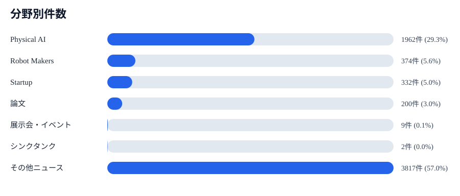
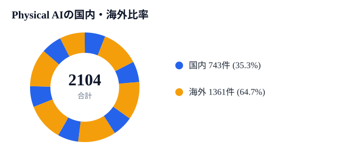
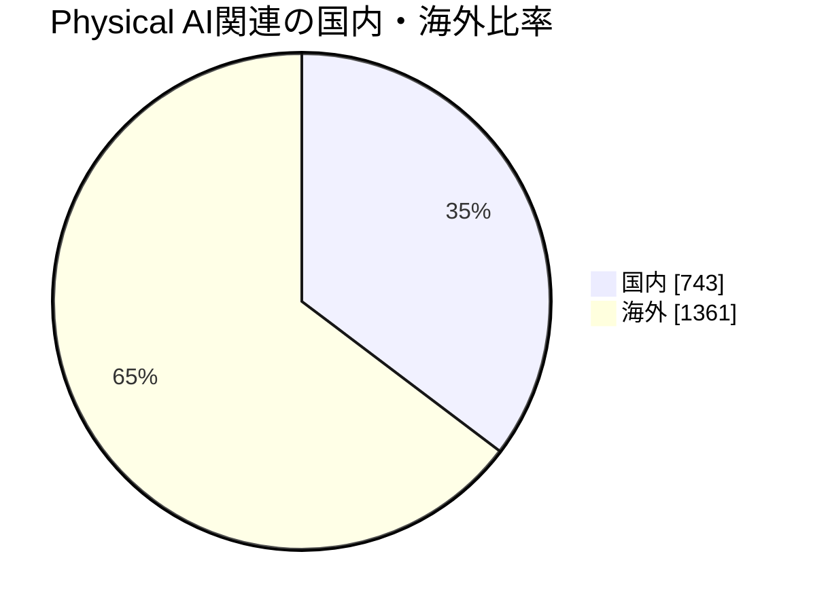
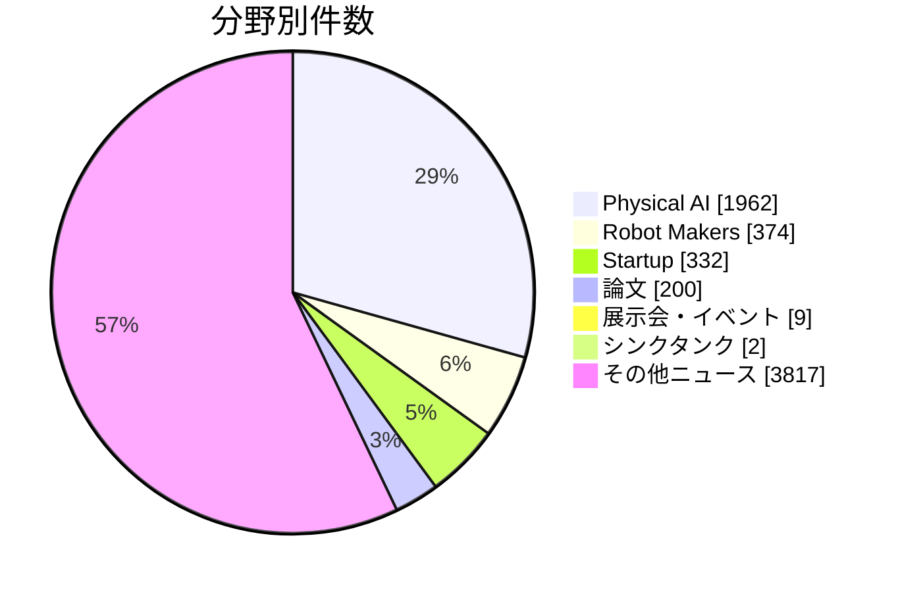

# 2026年7月 TechInfo月次レポート

- 対象件数: 6696件
- 前月（2026-06）: 12690件
- 前月比: -5994件
- Physical AI関連: 2104件

## サマリーグラフ

### Mermaid版

*Mermaid非対応のビューアーでは、以下の表で数値を確認できます。*

## 分野別件数

| 分野 | 件数 | 前月 | 増減 |
|---|---:|---:|---:|
| Physical AI | 1962 | 3516 | -1554 |
| Robot Makers | 374 | 318 | +56 |
| Real Haptics | 0 | 0 | +0 |
| Startup | 332 | 412 | -80 |
| 論文 | 200 | 462 | -262 |
| 展示会・イベント | 9 | 3 | +6 |
| 政策 | 0 | 0 | +0 |
| シンクタンク | 2 | 3 | -1 |
| 企業 | 0 | 0 | +0 |
| その他ニュース | 3817 | 7976 | -4159 |
| その他 | 0 | 0 | +0 |

## 分野別の動向

### Physical AI

Physical AIは1962件で全体の29.3%を占め、前月から1554件減少しました。 主な情報源はGoogle News / Physical AI（1955件）、Google News / AI Agents（7件）です。

主なテーマ: ヒューマノイド（687件）、製造・産業ロボット（139件）、投資・事業化（129件）、VLA・基盤モデル（54件）、自律移動・モビリティ（51件）

代表的な情報:

- [Terrifying Rescue Robot Comes With Instructions To ‘Kill It’ - Newsweek](https://news.google.com/rss/articles/CBMilwFBVV95cUxQNmlfbURWRWVYTWhOdXEwbnZEY2dTTER6V1BTQ25yM3p3MGRveXpLUEdJNGU5LWxXaFB5alNhdkViVThXdXRFel9Ga1c2RHkzbDIxNWxqcG5UdkZFdFlVT3FjWmlIVGlEdU91QThGQ2dhRUMzMVJJbEZzMkJKYnZsSWsyUFhPY1ZlWXh1OVZ0VHE3b2xSMGJF?oc=5) (2026-07-31) — Google News / Physical AI
- [Embodied Intelligence: The Hidden Power Transforming Modern Recruitment Software - 36 Kr](https://news.google.com/rss/articles/CBMiU0FVX3lxTE9pR0pmQjl1OTM4clgwbkFONVdKWG0xNmg5cm1qa0NWWW1YMjhxNWRpQm92TWdTYWd2dnZfZWZZcmZZNzJJNVJUSUhhZ3FYcFZ0Zmg0?oc=5) (2026-07-31) — Google News / Physical AI
- [Google’s Gemini AI can now walk around as a humanoid - Yahoo Finance UK](https://news.google.com/rss/articles/CBMif0FVX3lxTE1RS24tcnJjY1NkM1JTWlp5dXl4NnljMGY3LV9KdlhQRHBMRTdLRDlUTHFDZHFraF93UHJ6OWV5eHRZM3dJeUs1NWZkLXdleFV2bTAtM1pEUFNKWFpWSmkyS1Q1YThYRUJzdXNRYzA2OFR0V2FmbXFRRjNqbGc2WFk?oc=5) (2026-07-31) — Google News / Physical AI

### Robot Makers

Robot Makersは374件で全体の5.6%を占め、前月から56件増加しました。 主な情報源はGoogle News / Robot Makers（374件）です。

主なテーマ: 製造・産業ロボット（47件）、投資・事業化（8件）、VLA・基盤モデル（5件）、遠隔操作・ハプティクス（4件）、自律移動・モビリティ（3件）

代表的な情報:

- [Fanuc Corp. 1Q Americas Revenue Y58.1B, Up 25% on Year >6954.TO - moomoo.com](https://news.google.com/rss/articles/CBMikgFBVV95cUxOcWNZUTctdDZLREhvTFg2UzNybmRSczVDcXdXRFBqNE9Eb0dfSVZrcDB2SW9uUS1qTFY5c0laWkp5T09Cc0RMbDNFbkJiaUFGTXlEb3o5a2lEWUpBX1hiNTY5MDV3bGtDaDFFOXFRSWpKZml6bVZyNnpWNTdhSnZNRVVWUGlORzR5UTk0SHZVTmJ5Zw?oc=5) (2026-07-31) — Google News / Robot Makers
- [Fanuc Corporation Reports Earnings Results for the First Quarter Ended June 30, 2026 - marketscreener.com](https://news.google.com/rss/articles/CBMi0gFBVV95cUxNNm43MEdPaEllcVItT1VZQUVfLXFrY0tTX3FiWFlKeHhCZy1PYnI2M1lSZWF6eWRqYnBRdHVtdHhYWmtEZ1laMUZZYnRXY2NsVmUyeE1QZVljX1F3SUo1Snpfc0IyM2ZXUFNsNDJWZ1RuTk5vdkdzeWpUTEdncDBLMmVEYmRkOFV6QzlBZzFDSG9MUXRNc016TUI5aS1wYUNtYjZmWTFFa1A2TzFsUGk3RzJIWGpUNTNINXJWcDkwN1JaWHBfazJ4S1VFZFYwbGk3bUE?oc=5) (2026-07-31) — Google News / Robot Makers
- [ADR主要銘柄(日本)-TDK、日東電工が上昇、ファナック、ソフトバンクGが下落 - tradingview.com](https://news.google.com/rss/articles/CBMicEFVX3lxTE54cGRVclIxSXBtc1NVLXRvazQwMVg1WTFTVFlEU3hNMG81TEEweVhMOGF3UHNNMHgta2l6MHhNVHJSbC00NG52eVJJdnZKNnYxamZNX2tyLWhueEdqczRjSHV3Slp4NzM2Nk10TjNVdVo?oc=5) (2026-07-31) — Google News / Robot Makers

### Real Haptics

Real Hapticsは当月・前月とも収集がありませんでした。

### Startup

Startupは332件で全体の5.0%を占め、前月から80件減少しました。 主な情報源はStartup / AI Robotics（116件）、Startup / Humanoid（109件）、Startup / Funding（74件）です。

主なテーマ: 投資・事業化（332件）、ヒューマノイド（156件）、製造・産業ロボット（17件）、自律移動・モビリティ（9件）、VLA・基盤モデル（3件）

代表的な情報:

- [暗号資産VC大手Paradigm、12億ドルの第4号ファンドはAI・ロボティクスに衣替え - BRIDGE(ブリッジ)](https://news.google.com/rss/articles/CBMiakFVX3lxTE8wUE1FWHpta3RqSjNvUGkxRzFPMFNJYnVDOS1KVm41bHdZeDZfV01HSmZ6Q2ItT1hqeE5iNzJyMFVlOXBuOTVReEo2dXN2WjVCNXpQX0lFcW1qRnAzQzlfYnBOZHRrWHBzMmc?oc=5) (2026-07-31) — Startup / AI Robotics
- [Viral Chainsaw Centaur Robot for Wildfires Runs on Joysticks, Not Algorithms - Tech Times](https://news.google.com/rss/articles/CBMiwAFBVV95cUxQRE9aeTFyeWl3ZmhxNm9iUTJsdHFKcDZyNUR6OU1hZUdzTzVnY1d3djRVT3VmUEhzZUg0czJwdnpOVHBPaUtDS2NxTl9EN1l5R2dmSF9YbTl0MEc2Nkc2MFBld1A1MWNTbGF6XzJZVHNjU2ZvaWZUSk9uSW82TjN5MWJaNGtteWx2SGgtQWFlellETnFBVDRGYy1oZGJrU2F4OVhENDVMVEw2Z1UteG0zN0ZkNEo0RkVGYUNzQkRmRjI?oc=5) (2026-07-31) — Startup / AI Robotics
- [Robotics startup debuts humanoid housekeepers - Good Morning America](https://news.google.com/rss/articles/CBMiX0FVX3lxTFA2YUxtcEoyU3dYeFlLNU15SGhwb200bmk5eXlOX2dLTE5GTF9qU2p5Qk91ZktPbGw3ZGEzTHliQi1oRnJTREtGLW9yY1ltbURYUVNpaEpRSVF5VmV4Rklj0gFkQVVfeXFMTzVJUV9FcW5hWlhkNTB2a3BLSUNKdUtKak5wdnhsY3NqenFrYjNXM1dOdU1oOGRMRXpEbFRxbkJnaFlLSUFFT05uRGdFMHFfam45dHJvQlVHaUtOenR5SExNcGxwWQ?oc=5) (2026-07-31) — Startup / Humanoid

### 論文

論文は200件で全体の3.0%を占め、前月から262件減少しました。 主な情報源はarXiv（200件）です。

主なテーマ: 政策・規制（66件）、シミュレーション・学習（57件）、VLA・基盤モデル（50件）、自律移動・モビリティ（26件）、ヒューマノイド（20件）

代表的な情報:

- [PAC-MAN: Perception-Aware CBF-RL for Whole-Body Safety in Humanoid Dodgeball](https://arxiv.org/abs/2607.28623v1) (2026-07-30T17:59:35Z) — arXiv
- [FA-RDP: A Frequency-Adaptive Reactive Diffusion Policy for Contact-Rich Manipulation](https://arxiv.org/abs/2607.28596v1) (2026-07-30T17:47:49Z) — arXiv
- [X-NavDP: Generalizing Navigation Diffusion Policy to Novel Behavior and Embodiments with Group Q-score Reweighted Matching](https://arxiv.org/abs/2607.28560v1) (2026-07-30T17:26:12Z) — arXiv

### 展示会・イベント

展示会・イベントは9件で全体の0.1%を占め、前月から6件増加しました。 主な情報源はExhibition Search / www.manufacturing-world.jp（3件）、Exhibition Search / tf.jma.or.jp（2件）、Exhibition Search / www.next-business-expo.jp（1件）です。

主なテーマ: 製造・産業ロボット（8件）、投資・事業化（3件）、自律移動・モビリティ（2件）、シミュレーション・学習（1件）、遠隔操作・ハプティクス（1件）

代表的な情報:

- [Automation Expo 2026 | Asia's Largest Automation & Robotics Show [2026-07-22]](https://www.automationindiaexpo.com/) (2026-07-22) — Exhibition Search / www.automationindiaexpo.com
- [フィジカルAI・ロボット展 | NEXT BUSINESS EXPO SUMMER 2026 [2026-07-16]](https://www.next-business-expo.jp/physical-ai) (2026-07-16) — Exhibition Search / www.next-business-expo.jp
- [工場の搬送と協働ロボット展 | TECHNO-FRONTIER 2026 [2026-07-15]](https://tf.jma.or.jp/outline/robot.html) (2026-07-15) — Exhibition Search / tf.jma.or.jp

### 政策

政策は当月・前月とも収集がありませんでした。

### シンクタンク

シンクタンクは2件で全体の0.0%を占め、前月から1件減少しました。 主な情報源は電通総研（2件）です。

主なテーマ: 自律移動・モビリティ（1件）

代表的な情報:

- [Copilot Studio で既存エージェントを連携する2つの構成パターン - 電通総研 テックブログ](https://tech.dentsusoken.com/entry/2026/07/27/Copilot_Studio_%E3%81%A7%E6%97%A2%E5%AD%98%E3%82%A8%E3%83%BC%E3%82%B8%E3%82%A7%E3%83%B3%E3%83%88%E3%82%92%E9%80%A3%E6%90%BA%E3%81%99%E3%82%8B2%E3%81%A4%E3%81%AE%E6%A7%8B%E6%88%90%E3%83%91%E3%82%BF) (2026-07-27) — 電通総研
- [DevSecOpsを支える新サービス「AWS Security Agent」を触ってみた - 電通総研 テックブログ](https://tech.dentsusoken.com/entry/2026/07/13/DevSecOps%E3%82%92%E6%94%AF%E3%81%88%E3%82%8B%E6%96%B0%E3%82%B5%E3%83%BC%E3%83%93%E3%82%B9%E3%80%8CAWS_Security_Agent%E3%80%8D%E3%82%92%E8%A7%A6%E3%81%A3%E3%81%A6%E3%81%BF%E3%81%9F) (2026-07-13) — 電通総研

### 企業

企業は当月・前月とも収集がありませんでした。

### その他ニュース

その他ニュースは3817件で全体の57.0%を占め、前月から4159件減少しました。 主な情報源はGoogle News / AI Agents（3555件）、Google News / Physical AI（262件）です。

主なテーマ: 投資・事業化（110件）、自律移動・モビリティ（105件）、政策・規制（56件）、製造・産業ロボット（47件）、ヒューマノイド（29件）

代表的な情報:

- [DataBahn Raises $40M to Accelerate Innovation Across the Agentic Data Control Plane - HPCwire](https://news.google.com/rss/articles/CBMizAFBVV95cUxOSzJxUFBYMWZxOXdiYy1EXzZaYm1UMGM2elJFMkw1b0F6aWVKU3NWZHQyaTlwczlVSENHclNRdkE4dl9NNXl4bnRxc1pnT0lFYWNhUXhoUkZSbFZkckNGUmZyMjZzVUdnWk5xTGJKcDcyWEk0bXVCQmhkNVh1TWhHdzN5VTg1OVd5ZTlrdUJ2TUk3UVR2NEgydExSY3gwb19HS1RnYVEtNzZDaEo0RlRqT0dfSF9pMy1hemtMdzNQS2N4QkdzRnZKcDFyRzM?oc=5) (2026-07-31) — Google News / AI Agents
- [Factbox-What We Know About the Rogue AI-Agent Security Breaches - U.S. News - Money](https://news.google.com/rss/articles/CBMiwAFBVV95cUxPR0o1VmdpT1UxaWxDemhyTGNWMUI2dUoyQ2t0RDZ1TW9XRE9NRHMxZzZwd3IyR3Z2UlhGU2c5ZHpfcTNpVnFybjJjTE1zdFVrdUJkbmN1dzJrMGJIU0tienRCUUt4M1FsWmZUal91dThHb2RrbXNkclhoSlBqY0prc2VRQTBKS2NncDN3VkZMNGhXamNlMkdCbFhGaWVqWWp3dTZpQy1ETjNBck9NWDNLRXQ5SnowZUlSZ3FWNHNmeDk?oc=5) (2026-07-31) — Google News / AI Agents
- [TDSE---オンプレミス型AIエージェント基盤「TDSE_AI FORGE」の提供を本格開始 - 株探](https://news.google.com/rss/articles/CBMiYEFVX3lxTFBlZ19TQTc5S296SnFaUHAzam4yYy1tNXR6b09Oc3pRWVV1LWk5dmZFeHZTNlBhQzJZVkk4cXNidUtCeUNxdU1aNUEzeVMyTTltOWdscDdFQjRnVExYMnZpWg?oc=5) (2026-07-31) — Google News / AI Agents

### その他

その他は当月・前月とも収集がありませんでした。

## 国内Physical AIの動向

国内ではPhysical AI関連を743件確認しました。主なテーマはヒューマノイド（81件）、投資・事業化（68件）、製造・産業ロボット（66件）です。

### 主なテーマ

- ヒューマノイド: 81件
- 投資・事業化: 68件
- 製造・産業ロボット: 66件
- VLA・基盤モデル: 26件
- 政策・規制: 26件
- 自律移動・モビリティ: 14件
- 遠隔操作・ハプティクス: 4件
- シミュレーション・学習: 2件

### 代表的な情報

- [北九州市「地域産業クラスター計画」 フィジカルAI先進地へ 政令市で唯一 政府戦略に認定 /福岡 - 毎日新聞](https://news.google.com/rss/articles/CBMiaEFVX3lxTE9ta1RSMTNkQ3d0cU0wc0MwZGI2RmpaX2sxVF8yRHEzcU5XNUVDN2twS25FdFVKRFZZdlg3VjIwRUsxMnd4VC1hNjlxeWUzTThtOTdmZHJ6MF9ZX2J4dUlfbmVPT1BvaUN3?oc=5) (2026-07-31) — Google News / Physical AI
- [フィジカルAI将来的展望語る - tonichi.net](https://news.google.com/rss/articles/CBMiXEFVX3lxTE1GRDhpQ0FTbk9HTmlESDhhV1FwYzJrYXZXQ3NJT0JMSjI4VDVDMXJhUkpmQkhJc1NMeVZvZTdiNExxMElISFJkcEVtVzBpVm51LTMwYzN1Tlc4T0hK?oc=5) (2026-07-31) — Google News / Physical AI
- [フィジカルAIで変革を 高松でセミナー 企業担当者ら学ぶ 産業別に活用事例紹介|四国新聞WEB朝刊 - 四国新聞](https://news.google.com/rss/articles/CBMid0FVX3lxTFBxZUJPWVk5ZmVEcWVuTWtDOGRTV2t5TDhtblVodzV0blNIYWpNajFvWkNHRUlpNlZyTUVjYmU3MmR1bllwQWxUTGV1QlQzcXAzQ0F3WVI4VUFRVTNOTDhJQXNiSTRpeGlkb2N1dmxFRjloUXA0a0Q40gF8QVVfeXFMTUZPbzk0MTN0dUt2UlZ3MHBRMWxQSzUyQkNZNUFkbzZSdVNmN3gzSk9HWVR3bVJuNTF6ZU1SUVdkSEttWHZTSm9HbTRlQWlkWTJ3RVl4dFJFZEMzZDVsMXZkVHBZS1lQRjVmZUNKcmFUcXdTZWlLeGNneTA3Rw?oc=5) (2026-07-31) — Google News / Physical AI
- [【日本株】AI相場の次なる主役「フィジカルAI」の本命株を紹介! 工作機械大手で業績が急回復中の「DMG森精機」と、エヌビディアと提携の「ファナック」に注目! - ダイヤモンド・オンライン](https://news.google.com/rss/articles/CBMiU0FVX3lxTE91eDI4Y2VybUVidXpJdlRIOHNCR0NaemszWmQybllMeUJrc1lSMkc3MUprcnByVkRiS1ZaSDU2MEg3YkdKa3ZpSmo1aTJiUFRWZ2hB?oc=5) (2026-07-31) — Google News / Physical AI
- [フィジカルAIまとめ読み 「入門」LIVEの予習・復習に12本 - 日本経済新聞](https://news.google.com/rss/articles/CBMihwFBVV95cUxOWndEbXNJZjg3eFJVTlR1Ql9Db0VKVzRXN2pSUVpuQXRCNjN4YzJiN3JZYXl2RzBKLVdXSVl5WHUtalJpd1hibHdlLU9neERoRGowWFdfVFJPMmpESzNaVmhkOEFCaGpUd0dSb0dQNk02a1lKRlJZWV9PWFFVMER4bUUtZlR3VWM?oc=5) (2026-07-31) — Google News / Physical AI

## 海外Physical AIの動向

海外ではPhysical AI関連を1361件確認しました。主なテーマはヒューマノイド（611件）、投資・事業化（82件）、製造・産業ロボット（82件）です。

### 主なテーマ

- ヒューマノイド: 611件
- 投資・事業化: 82件
- 製造・産業ロボット: 82件
- VLA・基盤モデル: 75件
- 自律移動・モビリティ: 44件
- 政策・規制: 26件
- シミュレーション・学習: 20件
- 遠隔操作・ハプティクス: 6件

### 代表的な情報

- [Terrifying Rescue Robot Comes With Instructions To ‘Kill It’ - Newsweek](https://news.google.com/rss/articles/CBMilwFBVV95cUxQNmlfbURWRWVYTWhOdXEwbnZEY2dTTER6V1BTQ25yM3p3MGRveXpLUEdJNGU5LWxXaFB5alNhdkViVThXdXRFel9Ga1c2RHkzbDIxNWxqcG5UdkZFdFlVT3FjWmlIVGlEdU91QThGQ2dhRUMzMVJJbEZzMkJKYnZsSWsyUFhPY1ZlWXh1OVZ0VHE3b2xSMGJF?oc=5) (2026-07-31) — Google News / Physical AI
- [Embodied Intelligence: The Hidden Power Transforming Modern Recruitment Software - 36 Kr](https://news.google.com/rss/articles/CBMiU0FVX3lxTE9pR0pmQjl1OTM4clgwbkFONVdKWG0xNmg5cm1qa0NWWW1YMjhxNWRpQm92TWdTYWd2dnZfZWZZcmZZNzJJNVJUSUhhZ3FYcFZ0Zmg0?oc=5) (2026-07-31) — Google News / Physical AI
- [Google’s Gemini AI can now walk around as a humanoid - Yahoo Finance UK](https://news.google.com/rss/articles/CBMif0FVX3lxTE1RS24tcnJjY1NkM1JTWlp5dXl4NnljMGY3LV9KdlhQRHBMRTdLRDlUTHFDZHFraF93UHJ6OWV5eHRZM3dJeUs1NWZkLXdleFV2bTAtM1pEUFNKWFpWSmkyS1Q1YThYRUJzdXNRYzA2OFR0V2FmbXFRRjNqbGc2WFk?oc=5) (2026-07-31) — Google News / Physical AI
- [IDC: China's industrial embodied intelligent robot market is projected to reach approximately RMB 5.74 billion in 2025, with commercialization accelerating across the board. - news.futunn.com](https://news.google.com/rss/articles/CBMirwFBVV95cUxQTXNZMXZlUGJ5VFZDY0lRVnR6bEZweUgtREMzLVZ3bW43Um9DcU10S3lYZFZTY0VzVnpPTUlyanBweXBuY1pKSDlDRGJvWmJKLWtNaE5HUzl6MWowZzhlLTE3YV85WU5maWE3NzI3V0hGcGlYWkRKY1FzVDRKallTVWJPX3NKUnBwVUY1Y3pielRETVFDeklfSFJCRmFYczJsUS1mMkZHOUFodHZaX1VJ?oc=5) (2026-07-31) — Google News / Physical AI
- [This new robot centaur designed to save lives is pure nightmare fuel - Fast Company](https://news.google.com/rss/articles/CBMicEFVX3lxTFBET29EVGIxMEs2Zl9nVkp5SThGYVNjYzVybWpTNFplNDUtTjVxTHM2WUZWazVSdWFFVDAydktxVWVzbFZaQVVsQ0V4ZEN2bXo5SER5SlY0YmJ5blBBTzF0NG8xS1NOMFh5UjYtbWtqRW4?oc=5) (2026-07-31) — Google News / Physical AI

## 判定方法

- 集計月は `published_at` の年月を使用しています。
- 分野は `source_type`、`source_name`、タイトル・要約内のキーワードから主分類を1つ付与しています。
- 国内・海外はソース名、タイトル、要約、本文の地名・媒体名と言語から推定しています。
- 動向文は収集データの件数とキーワード出現に基づく自動要約です。

生成日時: 2026-08-02 18:22
